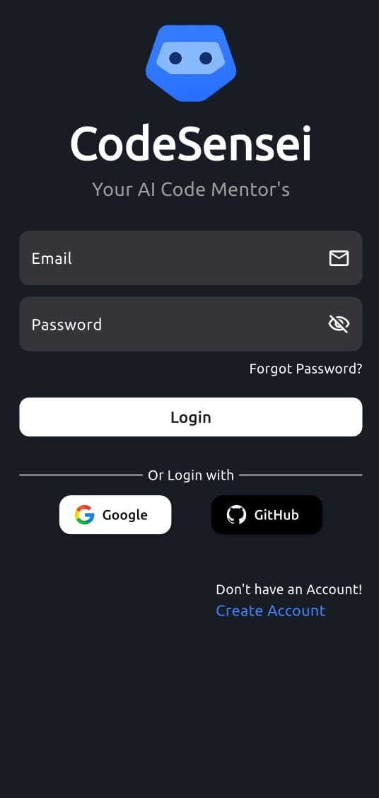
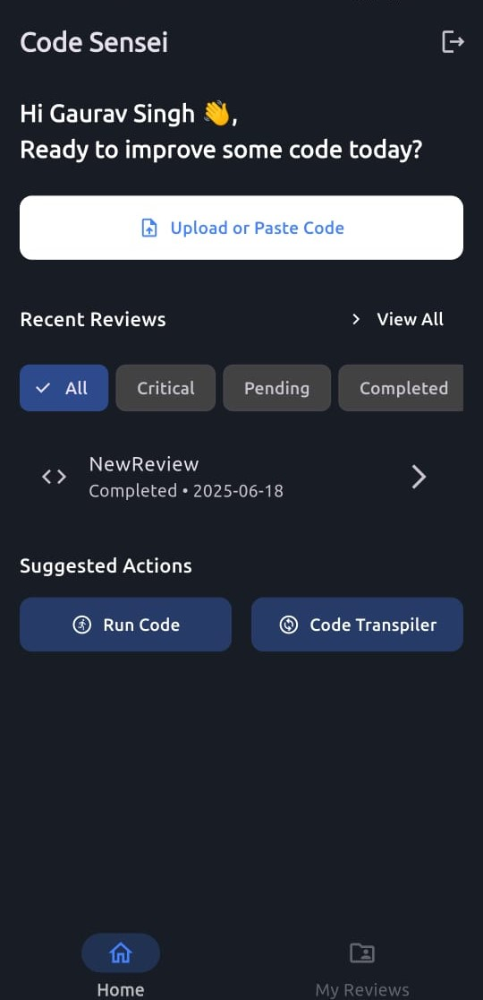
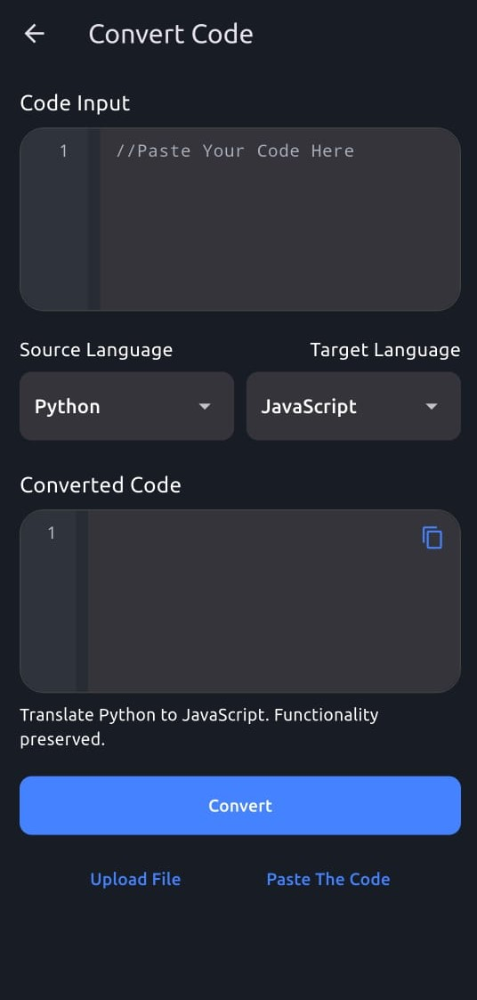

# 🚀 CodeSensei – AI Code Review App

AI-powered Flutter app to review, optimize, and transpile your code on the go.

---

## 📱 UI Screenshots

<p float="left">
  
  
  
  
</p>

---

## 🌟 Features

- 🔍 AI-Powered Code Review with Suggestions
- 📤 Upload or Paste Code for Instant Feedback
- 🔄 Code Transpiler: Convert Code Between Languages
- 🧾 Generate and Download Code Reports as PDF
- 🔐 Google Sign-In Authentication

---

## 🛠️ Tech Stack

**Frontend:** Flutter, Dart  
**Backend:** Spring Boot
**Database:** MySQL  
**Others:**  Gemini AI API,Groq AI API,Deepseek Ai API &  Railway (for deployment)

---

## 🧠 AI Integration

- Uses **Gemini AI API** ,**Groq AI API** **Deepseek Ai API**for code analysis and review.
- Automatically detects common bugs, anti-patterns, and recommends best practices.
- Supports multi-language transpilation (e.g., Dart → JavaScript).

---

## 🚀 Deployment

- **Frontend:** Didn'T Deployed
- **Backend:** sparkling-flow-production.up.railway.app

---

## 🧪 Installation (For Local Setup)

```bash
# Clone the repo
git clone https://github.com/GAURANG1205/codesensei.git

# Navigate to frontend
cd codesensei/Frontend
flutter pub get
flutter run

# Backend
cd ../Backend
./mvnw spring-boot:run
